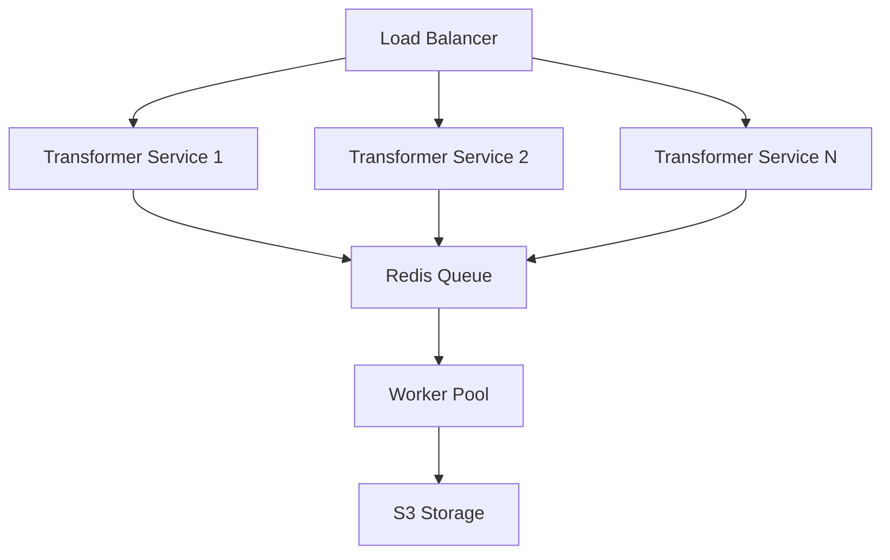

# Dotformer Platform Scalability and Performance Improvements

## Current Architecture Analysis

The current Dotformer platform consists of:
1. Frontend (Next.js)
2. Backend (Express.js)
3. Transformer Service (Express.js)
4. JavaScript SDK
5. S3 Storage
6. PostgreSQL Database

## Scalability Challenges and Solutions

### 1. Image Transformation Service

#### Current Implementation
- Single-threaded image processing using Sharp
- Basic caching using S3
- No queue system for transformation requests
- No load balancing

#### Recommended Improvements

##### a. Distributed Processing

1. **Implement Worker Pool**
   - Use Node.js worker threads for parallel image processing
   - Configure optimal thread count based on CPU cores
   - Implement worker health monitoring

2. **Message Queue System**
   - Implement Redis for job queuing
   - Add priority levels for different transformation types
   - Implement retry mechanisms for failed jobs

3. **Load Balancing**
   - Deploy multiple transformer service instances
   - Use AWS ALB or Nginx for load balancing
   - Implement health checks and auto-scaling

### 2. Storage Optimization

#### Current Implementation
- Direct S3 storage
- Basic caching with CloudFront
- No storage tiering

#### Recommended Improvements

1. **Storage Tiering**
   - Implement S3 Intelligent Tiering
   - Move older/less accessed files to S3 Glacier
   - Use S3 Lifecycle policies for automatic tiering

2. **Caching Strategy**
   - Implement multi-level caching:
     - CDN (CloudFront)
     - Redis cache for frequently accessed transformations
     - Local cache in transformer services

3. **Storage Optimization**
   - Implement image compression before storage
   - Use WebP format by default for better compression
   - Implement lazy loading for large files

### 3. Database Optimization

#### Current Implementation
- Basic PostgreSQL setup
- Prisma ORM
- No read replicas

#### Recommended Improvements

1. **Database Scaling**
   - Implement read replicas for better read performance
   - Use connection pooling
   - Implement database sharding for large datasets

2. **Query Optimization**
   - Add database indexes for frequently queried fields
   - Implement query caching
   - Use database views for complex queries

3. **Data Archiving**
   - Implement data archiving strategy
   - Move old data to separate tables
   - Use partitioning for large tables

### 4. API and Frontend Optimization

#### Current Implementation
- Basic API rate limiting
- No API versioning
- Basic frontend caching

#### Recommended Improvements

1. **API Optimization**
   - Implement GraphQL for flexible data fetching
   - Add API versioning
   - Implement request batching
   - Add response compression

2. **Frontend Optimization**
   - Implement service workers for offline support
   - Use React Suspense for better loading states
   - Implement code splitting
   - Add progressive image loading

3. **Caching Strategy**
   - Implement Redis for API response caching
   - Use browser caching effectively
   - Implement stale-while-revalidate pattern

### 5. Monitoring and Observability

#### Current Implementation
- Basic error logging
- No performance monitoring
- Limited metrics

#### Recommended Improvements

1. **Monitoring System**
   - Implement Prometheus for metrics collection
   - Use Grafana for visualization
   - Add distributed tracing with Jaeger

2. **Logging System**
   - Implement structured logging
   - Use ELK stack for log aggregation
   - Add log correlation IDs

3. **Alerting System**
   - Set up alert thresholds
   - Implement automated incident response
   - Add health check monitoring

### 6. Security Improvements

#### Current Implementation
- Basic JWT authentication
- API key authentication
- Basic rate limiting

#### Recommended Improvements

1. **Authentication**
   - Implement OAuth 2.0
   - Add multi-factor authentication
   - Implement session management

2. **API Security**
   - Add API gateway for better security
   - Implement request signing
   - Add DDoS protection

3. **Data Security**
   - Implement encryption at rest
   - Add data masking for sensitive information
   - Implement secure file deletion

## Implementation Roadmap

### Phase 1: Core Infrastructure (1-2 months)
1. Implement worker pool for image processing
2. Set up Redis for job queuing
3. Configure load balancing
4. Implement basic monitoring

### Phase 2: Storage Optimization (1 month)
1. Implement storage tiering
2. Set up multi-level caching
3. Optimize image compression

### Phase 3: Database Optimization (1 month)
1. Set up read replicas
2. Implement query optimization
3. Add database monitoring

### Phase 4: API and Frontend (1-2 months)
1. Implement GraphQL
2. Optimize frontend performance
3. Add comprehensive caching

### Phase 5: Security and Monitoring (1 month)
1. Implement enhanced security measures
2. Set up comprehensive monitoring
3. Add automated alerting

## Performance Metrics

### Target Metrics
1. Image Transformation
   - Average processing time: < 500ms
   - 99th percentile: < 2s
   - Throughput: 1000+ transformations/second

2. API Performance
   - Average response time: < 100ms
   - 99th percentile: < 500ms
   - Availability: 99.99%

3. Database Performance
   - Query response time: < 50ms
   - Write latency: < 100ms
   - Read latency: < 20ms

## Cost Optimization

1. **Infrastructure Costs**
   - Use spot instances for non-critical workloads
   - Implement auto-scaling based on demand
   - Use reserved instances for stable workloads

2. **Storage Costs**
   - Implement data lifecycle policies
   - Use cost-effective storage tiers
   - Optimize data retention policies

3. **Network Costs**
   - Use CloudFront for content delivery
   - Implement request compression
   - Optimize data transfer patterns

## Conclusion

The proposed improvements will significantly enhance the platform's scalability, performance, and reliability. The phased implementation approach allows for gradual improvements while maintaining system stability. Regular monitoring and optimization will ensure the platform continues to meet performance targets as it scales. 